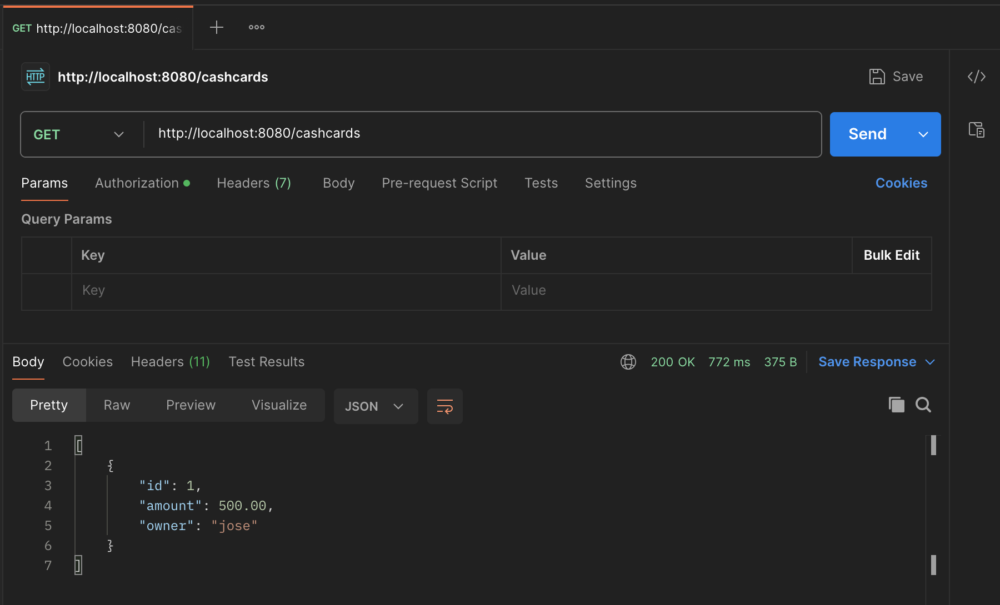

# CashCards REST API




## 💳 Description
CashCards is a RESTful API built with Java and Spring Boot that enables users to manage cash cards. Each cash card consists of an ID, amount, and owner. Users can create, retrieve, update, or delete cash cards via secure endpoints.

## ✨ Features
- Cash Card management with CRUD operations
- User management with role-based authorization
- Spring Security for Basic Authentication
- JPA/Hibernate integration with PostgreSQL
- Database schema versioning with Flyway
- Unit and integration tests using H2 in-memory database

## 🖥 Technology Stack
- **Framework**: Spring Boot
- **Build Tool**: Gradle
- **Database**: PostgreSQL (Production), H2 (Testing)
- **ORM**: JPA/Hibernate
- **Security**: Spring Security
- **Migration**: Flyway
- **Testing**: Spring Boot Test, JUnit

## 🏗 Project Structure
```
src/
├── main/
│   ├── java/
│   │   └── io/github/joherrer/cashcards/
│   │       ├── config/
│   │       │   └── SecurityConfig.java
│   │       ├── controller/
│   │       │   ├── CashCardController.java
│   │       │   └── UserController.java
│   │       ├── dto/
│   │       │   ├── CashCard.java
│   │       │   └── User.java
│   │       ├── model/
│   │       │   ├── CashCardEntity.java
│   │       │   └── UserEntity.java
│   │       ├── repository/
│   │       │   ├── CashCardRepository.java
│   │       │   └── UserRepository.java
│   │       ├── service/
│   │       │   └── CashCardUserDetailsService.java
│   │       └── CashCardApplication.java
│   └── resources/
│       ├── db/migration/
│       │   └── V1__init.sql
│       ├── static/
│       ├── templates/
│       ├── application.properties
│       ├── application-dev.properties
│       └── application-prod.properties
└── test/
    ├── java/
    │   └── io/github/joherrer/cashcards/
    │       ├── dto/
    │       │   ├── CashCardJsonTest.java
    │       │   └── TestCashCard.java
    │       ├── service/
    │       │   └── CashCardTestUserDetailsService.java
    │       └── CashCardApplicationTest.java
    └── resources/
        ├── io/github/joherrer/cashcards/dto
        │   ├── list.json
        │   └── single.json
        ├── application-test.properties
        ├── data.sql
        └── schema.sql
```

## 🛠 Development Setup

### Prerequisites
- Java 17+
- PostgreSQL 12+
- Gradle 7+
- PgAdmin 4

### Installation
1. Clone the repository:

    ```bash
    git clone https://github.com/joherrer/cashcards.git
    ```

2. Navigate to the project directory:

    ```bash
    cd cashcards
    ```

3. Set up the database:

    ```
    spring.datasource.url=jdbc:postgresql://localhost:5432/cashcards_db
    spring.datasource.username=your_username
    spring.datasource.password=your_password
    ```

4. Build the project:

    ```bash
    ./gradlew build
    ```

5. Run the application:

    ```bash
    ./gradlew bootRun --args='--spring.profiles.active=dev'
    ```

The API will be available at `http://localhost:8080`

## 📚 API Endpoints

### Cash Cards
- `GET /cashcards` - Retrieve all cash cards
- `GET /cashcards/{id}` - Retrieve specific cash card
- `POST /cashcards` - Create new cash card
- `PUT /cashcards/{id}` - Update existing cash card
- `DELETE /cashcards/{id}` - Delete cash card

### Users
- `POST /users/register` - Create new user (registration)

## 🔐 Authentication & Authorization

### Basic Authentication
All protected endpoints require Basic Authentication with username and password.

### User Roles
- **UNAUTHORISED**: Default role for new users; provides limited access.
- **AUTHORISED**: Grants full API access.

### Authorizing Users
1. Create a user through the API
2. Connect to PostgreSQL using PgAdmin 4
3. Update the user's role from `UNAUTHORISED` to `AUTHORISED`:

    ```
    UPDATE users SET role = 'AUTHORISED' WHERE username = 'your_username';
    ```

## 🧪 Testing

The project includes comprehensive tests using:
- **H2 Database** (In-memory database for testing)
- **TestUserDetailsService** (Service with hardcoded test users)
- **JSON Tests** (API response validation)
- **Logic Tests** (Business logic verification)

Run the tests:
```bash
./gradlew test
```

## 📁 Database Migrations

Database schema changes are managed using Flyway migrations located in `src/main/resources/db/migration/`.

Migration files follow the naming convention: `V{version}__{description}.sql`

## 📝 License

Copyright (c) 2025 Jose Herrera. All rights reserved.
