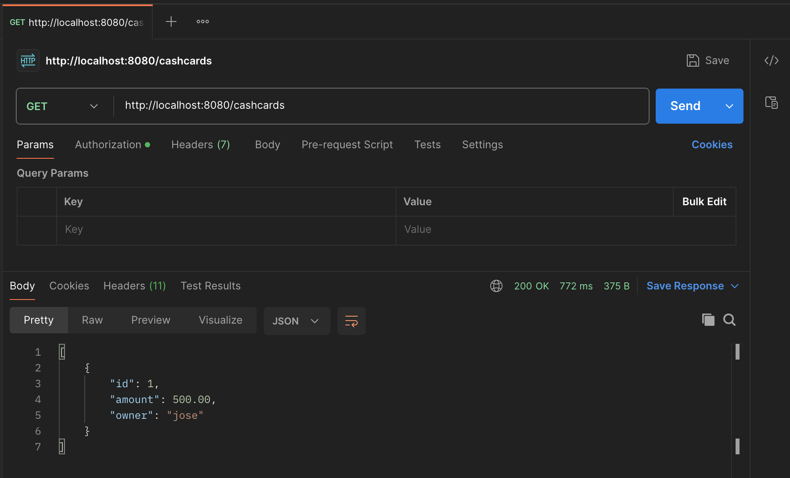

# CashCards REST API




## 💳 Description

CashCards is a RESTful API built with Java and Spring Boot that enables users
to manage cash cards. Each cash card consists of an ID, amount, and owner.
Users can create, retrieve, update, or delete cash cards via secure endpoints.

## ✨ Features

- Cash card management with CRUD operations
- User registration with role-based authorization
- Spring Security for Basic Authentication
- PostgreSQL database with JPA/Hibernate
- Database migrations with Flyway
- Health endpoint with Spring Boot Actuator
- Unit and integration tests with JUnit
- Docker and Docker Compose support
- GitHub Actions CI workflow

## 🖥 Technology Stack

- **Framework**: Spring Boot
- **Build Tool**: Gradle
- **Database**: PostgreSQL
- **ORM**: JPA/Hibernate
- **Security**: Spring Security
- **Migrations**: Flyway
- **Monitoring**: Spring Boot Actuator
- **Testing**: Spring Boot Test, JUnit, Testcontainers
- **Containerization**: Docker, Docker Compose
- **CI/CD**: GitHub Actions

## 🏗 Project Structure

```
.
├── .github/
│   └── workflows/
│       └── ci.yml
├── src/
│   ├── main/
│   │   ├── java/
│   │   │   └── io/github/joherrer/cashcards/
│   │   │       ├── config/
│   │   │       │   └── SecurityConfig.java
│   │   │       ├── controller/
│   │   │       │   ├── CashCardController.java
│   │   │       │   └── UserController.java
│   │   │       ├── dto/
│   │   │       │   ├── CashCard.java
│   │   │       │   └── User.java
│   │   │       ├── model/
│   │   │       │   ├── CashCardEntity.java
│   │   │       │   └── UserEntity.java
│   │   │       ├── repository/
│   │   │       │   ├── CashCardRepository.java
│   │   │       │   └── UserRepository.java
│   │   │       ├── service/
│   │   │       │   └── CashCardUserDetailsService.java
│   │   │       └── CashCardApplication.java
│   │   └── resources/
│   │       ├── db/migration/
│   │       │   └── V1__init.sql
│   │       ├── application.properties
│   │       ├── application-dev.properties
│   │       └── application-prod.properties
│   └── test/
│       ├── java/
│       │   └── io/github/joherrer/cashcards/
│       │       ├── dto/
│       │       │   ├── CashCardJsonTest.java
│       │       │   └── TestCashCard.java
│       │       └── CashCardApplicationTest.java
│       └── resources/
│           ├── io/github/joherrer/cashcards/dto
│           │   ├── list.json
│           │   └── single.json
│           ├── application-test.properties
│           └── data.sql
├── Dockerfile
└── docker-compose.yml
```

## 🛠 Development Setup

### Prerequisites

- Java 17+
- PostgreSQL
- Gradle
- PgAdmin 4
- Docker

### Installation

1. Clone the repository:

    ```bash
    git clone https://github.com/joherrer/cashcards.git
    ```

2. Navigate to the project directory:

    ```bash
    cd cashcards
    ```

3. Set up the database:

    ```
    spring.datasource.url=jdbc:postgresql://localhost:5432/cashcards_db
    spring.datasource.username=your_username
    spring.datasource.password=your_password
    ```

4. Build the project:

    ```bash
    ./gradlew build
    ```

5. Run the application:

    ```bash
    ./gradlew bootRun --args='--spring.profiles.active=dev'
    ```

The API will be available at `http://localhost:8080`

### Docker

Run the application and PostgreSQL together with Docker Compose:

```bash
docker compose --profile app up --build
```

The application container uses the `prod` profile and reads `DB_URL`,
`DB_USERNAME`, and `DB_PASSWORD` from the Docker Compose environment.

## 📚 API Endpoints

### Cash Cards

- `GET /cashcards` - Retrieve all cash cards
- `GET /cashcards/{id}` - Retrieve specific cash card
- `POST /cashcards` - Create new cash card
- `PUT /cashcards/{id}` - Update existing cash card
- `DELETE /cashcards/{id}` - Delete cash card

### Users

- `POST /users/register` - Create new user

### Health

- `GET /actuator/health` - Check application health

## 🔐 Authentication & Authorization

### Basic Authentication

All protected endpoints require Basic Authentication with a username and password.

Public endpoints:

- `POST /users/register`
- `GET /actuator/health`

### User Roles

- **UNAUTHORISED**: Default role for new users; provides limited access.
- **AUTHORISED**: Grants full API access.

### Authorizing Users

1. Create a user through the API
2. Connect to PostgreSQL using PgAdmin 4
3. Update the user's role from `UNAUTHORISED` to `AUTHORISED`:

    ```
    UPDATE users SET role = 'AUTHORISED' WHERE username = 'your_username';
    ```

## 🧪 Testing

The project includes:

- **Unit tests** for JSON serialization and deserialization.
- **Integration tests** for cash card operations, authentication,
  authorization, and validation.

Integration tests use Testcontainers with PostgreSQL. Docker is required
to run the tests locally.

Run the tests:
```bash
./gradlew test
```

## 📁 Database Migrations

Database schema changes are managed using Flyway migrations located in
`src/main/resources/db/migration/`.

Migration files follow the naming convention: `V{version}__{description}.sql`

## 📝 License

Copyright (c) 2025 Jose Herrera. All rights reserved.
